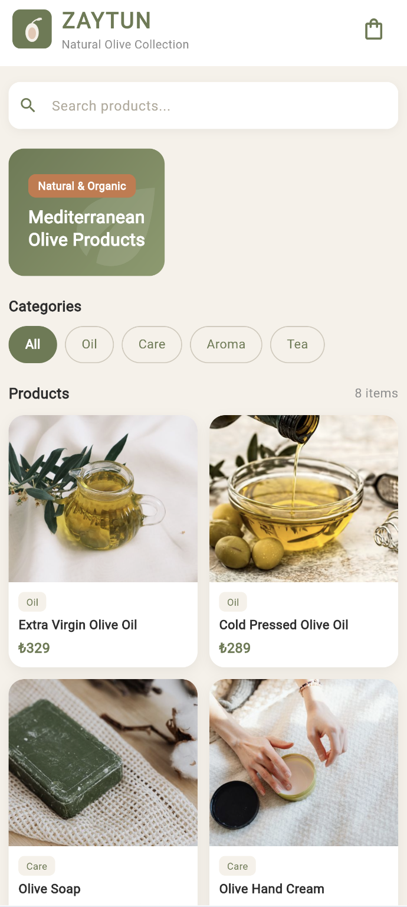
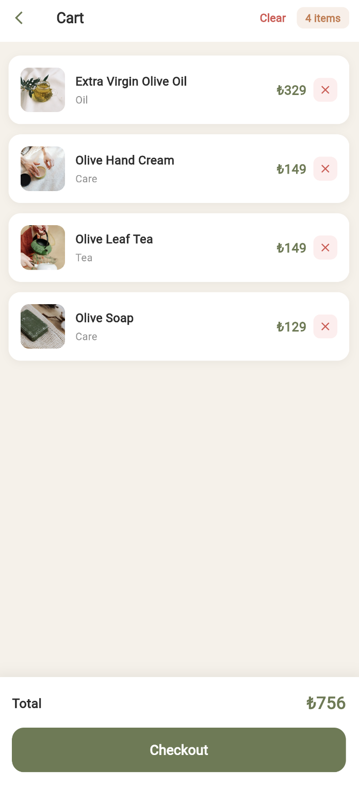
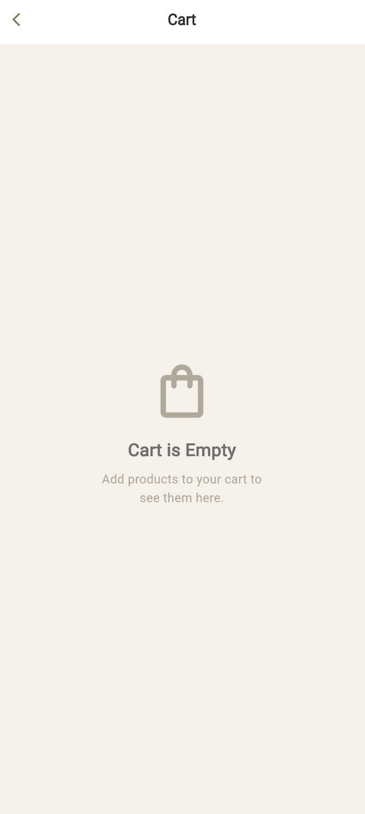

# ZAYTUN Mobile Catalog App

A mobile product catalog app built with Flutter for **ZAYTUN** — a brand focused on natural olive-based products.

## Flutter Version

Flutter 3.x / Dart 3.x

## Features

- Product listing with GridView
- Category filtering (Oil, Care, Aroma, Tea)
- Product search
- Product detail screen with description
- Add to cart functionality
- Cart with item count badge
- Remove individual items or clear entire cart
- Empty cart state
- Navigator-based screen transitions

## Screenshots

| Home Screen | Product Detail | Cart | Empty Cart |
|:-----------:|:--------------:|:----:|:----------:|
|  |  |  |  |

## Screens

| Screen | Description |
|--------|-------------|
| Home Screen | Product grid, search bar, category filters |
| Product Detail | Product image, description, add to cart button |
| Cart Screen | Cart items, total price, remove & clear, checkout |

## Setup

```bash
flutter pub get
flutter run -d chrome
```

## GitHub

[github.com/rahimecftc/zaytun-mobile](https://github.com/rahimecftc/zaytun-mobile)
